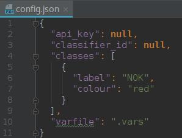

# How to detect details using Watson Visual Recognition

## Overview

- [Prerequisites](#prerequisites)
- [Scope](#scope)
- [Training](#training)
- [Run the app](#run-the-app)
- [Split your images into fragments](#split-images)
- [Potential improvements](#potential-improvements)

## Prerequisites

 - IBM Cloud account - [Sign in for a trial account](https://console.ng.bluemix.net/registration/) if you don't already have one.

## Scope

This app is designed to detect details in a large picture.

The Watson Visual Recognition service is good in recognizing **macroscopic patterns** but will usually identify two very similar images identically. To get different results from a given classifier, the images need to be sufficiently different.

The main idea there is to split the given image in several fragments, so that the details are in a macroscopic scale for the image Watson recieves.

For this project, we devide the image using a grid of a given number of rows and columns to fit the size of the details we want to detect.

We will suppose we're trying to identify if a detail is present _(OK)_ or absent _(NOK)_.

## Training

Because the data Watson will recieve from our app is the size of a detail we want to detect, the training data needs to be as well. We need to clip details from our training pictures for both OK and NOK classes of the classifier.

I strongly recommend the use of a negative classifier for unrelevant fragments of the image.

Your initial training datasets should contain between 15 and 25 pictures.

## Run the app

### A. Locally

- You can run the app locally using [npm](https://nodejs.org/).
- Clone the [GitHub repository](https://github.com/cyrillebenoit/visual-recognition).
- Open a terminal in said directory and run `npm install`.
- Copy `.config.json` and rename it `config.json`.
- Edit it and change :
    1. Watson Visual Recognition API key
    2. Classifier name
    3. Classes you want to display on the final image
- Run `npm start`

Your app is now running on [localhost:8080](localhost:8080).

### B. On IBM Cloud

**This is not the recommended way to use the app for now. It is not designed to be used in a production environment.**

You need to have the [Cloud Foundry CLI](https://github.com/cloudfoundry/cli) installed.

- Clone the [GitHub repository](https://github.com/cyrillebenoit/visual-recognition).
- Copy `.config.json` and rename it `config.json`.
- Edit it and change :
    1. Watson Visual Recognition API key
    2. Classifier name
    3. Classes you want to display on the final image
- Open a terminal and run `cf push`. 

You may have to edit the manifest file and set an unique application name.

## Split images

It is possible to use the application to split an image without sending it to Watson. This is useful for making your own datasets.

You need to set the api key or classifier id to `null`.
In this configuration, the file will be split and the initial image will be displayed when the process is over.
You will find the fragments in the tmp folder.

## Potential Improvements

This application can be improved by replacing the grid system by an object detection system, which would both make better fragments (the grid cannot always be adjusted) and prevent unrelevant fragments.